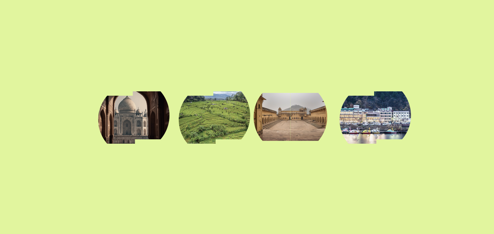
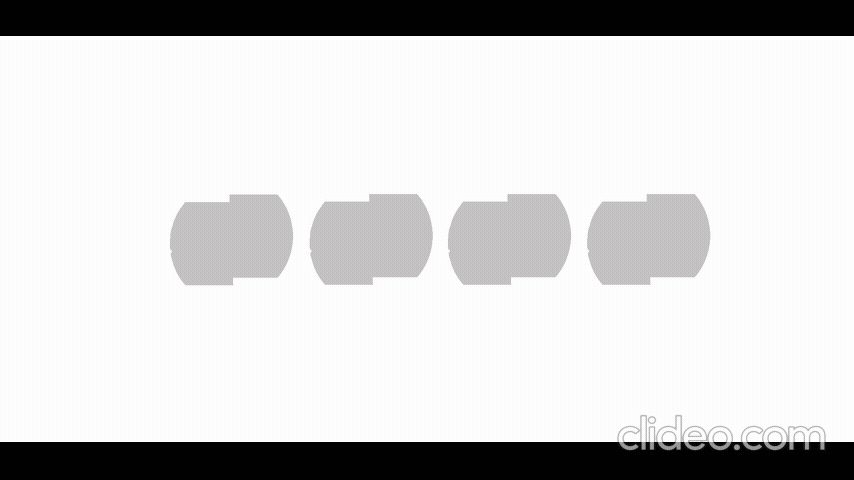
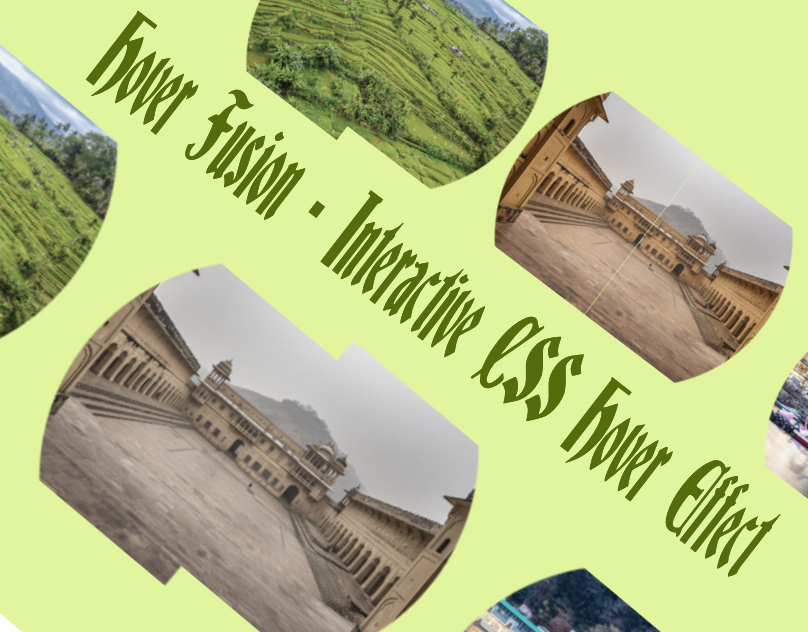

# Hover Fusion - Interactive CSS Hover Effect

### Author
##### Virendra D. Verma

<a href="https://www.linkedin.com/in/dharmendraverma95/" target="_blank">LinkedIn Profile </a>

<a href="https://www.behance.net/dhirukumar" target="_blank">Behance Profile </a>

# Project Overview

Hover Fusion is an interactive, CSS-only hover effect that splits an image in half and seamlessly merges it into one on hover. This effect provides a smooth transition and is perfect for modern web designs, creating a visually engaging experience for users. It is a clean, lightweight solution to enhance interactivity on your website without the need for JavaScript.

## Features
- CSS-Only Effect: No JavaScript required—pure CSS handles the animation and hover effect.
- Smooth Image Transition: On hover, the image splits into two halves and merges back together.
- Responsive Design: Fully adaptable to various screen sizes, ensuring it looks great on desktop and mobile.
- Customizable: Easily adjust the size, transition speed, and image content by modifying the CSS properties.
- Lightweight: Only uses HTML and CSS, making it a minimal and fast solution.

# Preview
SkewScroll Banner Style Section
 

 
SkewScroll Banner Style Section Start & End Point 
 

 
SkewScroll Banner Style Section UI UX Layout Start & End Point
 

 
SkewScroll Banner Style Section UI UX Layout
 

 
SkewScroll Banner Style Mobile Section 
 

 
Cover
 

 

### Technologies Used
<ul>
  <li>Graphic Design Software: Photoshop, Figma (for mockups)</li>
  <li>Web Tools (Optional): HTML5, CSS3 and JavaScript (Vanilla JS or jQuery for animation effects)  for any digital presentations or landing pages</li>
  <li>For clean and modern typography.
</li>
</ul>

###  Acknowledgments
Inspired by the power of CSS positioning and scrolling techniques.